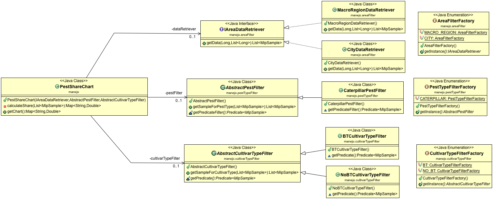

# Bridge Design Pattern Example
Although this project is not based on any particular tutorial, I mainly used the [Refactoring Guru](https://refactoring.guru/design-patterns/bridge) explanation as reference when implementing the code.

## Project Overview

There is no GUI for this project as the goal is to understand the structure. The idea is that we have three filters to be applied to data. `PestShareChart` represents the _Abstraction_ whereas `areaFilter`, `cultivarTypeFilter` and `pestTypeFilter` packages represent _Implementations_ and _Concrete Implementations_. The _Client_ calls the main method on `PestShareChart` that in turn calls appropriate filters and do complex operations to return the result.

Check the test class to see the code in action.

## Class Structure



As each package represents an _Implementation_, we focus only on classes in the `areaFilter` package, in addition to the _Abstraction_.

* `PestShareChart` represents the _Abstraction_. This is the class that is accessible by the _Client_. This class is responsible for calling appropriate _Implementations_ and using the result to perform complex operation;

* `IAreaDataRetriever` this is the first filter that is used. It defines the `getData()` method that depends on two parameters. These parameters are not part of the DP specification, but necessary for fulfilling the business rule of my example;

* `FoMacroRegionDataRetriever` represents a _Concrete Implementation_. This is the class responsible for retrieving data from the database;

* `AreaFilterFactory` simplifies the object creationg by defining a factory for the different filter types available for this package;

## Other Patterns
The factory pattern is used to simplify the creation of an object. These are `PestTypeFilterFactory`, `CultivarTypeFilterFactory` and `AreaFilterFactory`.

In addition, the template pattern is used to reuse the algorithm used in the interface of _Implementations_.

## Dependencies
The master branch does not feature any dependency.

## Project Setup
```
mvn clean test
```
